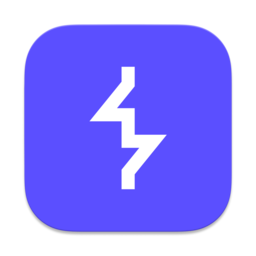

<div align="center">

<!-- Banner -->


<!-- Badges -->
[](https://www.linkedin.com/in/carlos-augusto-cls-sh7/)
[](https://tryhackme.com/p/cls.sh7)

</div>

---

## 🏴‍☠️ About Me

```yaml
alias: CLSxSH7
role: Offensive Security
focus: Pentest | Red Team | Vulnerability Research
```

I'm an offensive security enthusiast focused on **penetration testing**, **red team operations**, and **vulnerability research**. Constantly studying to improve my pentest and programming skills.

---

## 🎓 Education & Certifications

- 🎓 Graduated in IT Management from **[SENAC](https://www.sp.senac.br/)**
- 🎓 Postgraduate in Offensive Cybersecurity from **[FIAP](https://postech.fiap.com.br/)**
- 🏆 **CRTA — Certified Red Team Analyst**, from **[CyberWarfare Labs](https://cyberwarfare.live/)**
- 🧠 Constantly studying to improve my pentest and programming skills

---

## ⚡ Tech & Arsenal

<div align="center">

#### 🔧 Languages & Frameworks
<a href="https://skillicons.dev">
  
</a>

#### 🛠️ Tools I use on a daily basis
<a href="https://skillicons.dev">
  
  
</a>

</div>

---

## 🏆 TryHackMe

<div align="center">


</div>

---

## 📊 GitHub Stats

<div align="center">


<br/>


</div>

---

<div align="center">


</div>
